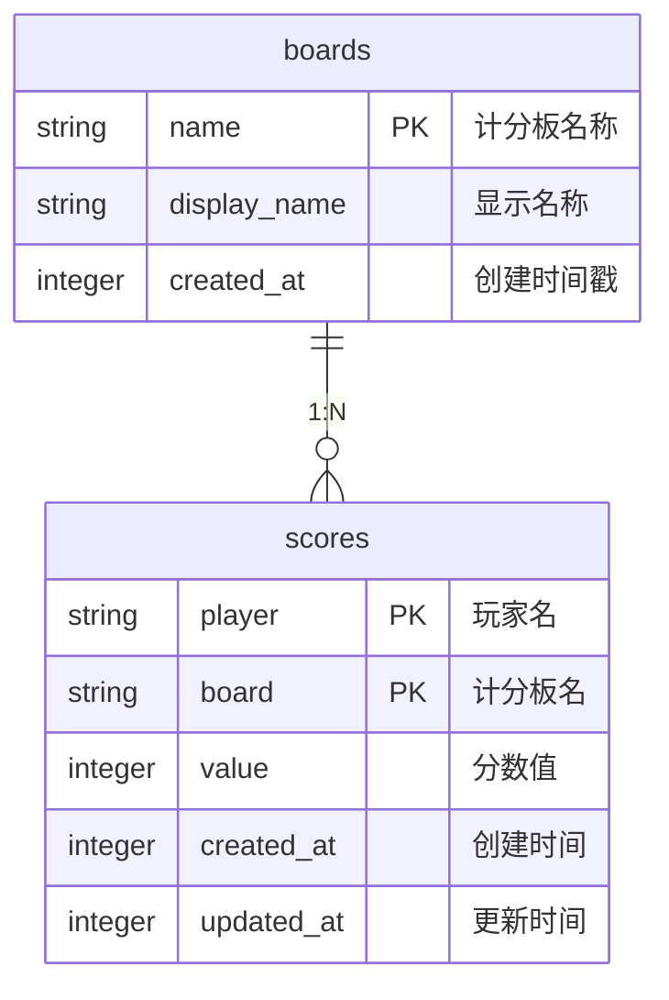

# 云计分板API 文档

## 概述
云计分板API是一个基于SQLite数据库的计分板管理系统，为其他插件提供高性能、线程安全的计分板操作接口。支持计分板的创建、删除、重命名、分数管理及排行榜查询等功能。

## 核心功能

### 1. 计分板管理
- 创建/删除计分板
- 重命名计分板
- 获取所有计分板列表

### 2. 分数操作
- 获取玩家分数
- 设置玩家分数
- 增加/减少玩家分数
- 重置玩家分数

### 3. 排行榜查询
- 获取指定计分板的前N名玩家数据

## API 详细说明

### 初始化插件
```python
entry = plugin_entry(ScoreboardPlugin, "云计分板API")
```

### 1. 获取玩家分数
```python
get_score(player: str, board: str) -> int
```
**参数**：
- `player`: 玩家名称
- `board`: 计分板名称

**返回值**：玩家分数（不存在时返回0）

**特性**：
- 自动创建不存在的计分板

### 2. 设置玩家分数
```python
set_score(player: str, board: str, value: int) -> None
```
**参数**：
- `player`: 玩家名称
- `board`: 计分板名称
- `value`: 要设置的分数值

**特性**：
- 自动创建不存在的计分板
- 原子操作保证线程安全

### 3. 增加玩家分数
```python
add_score(player: str, board: str, value: int) -> None
```
**参数**：
- `player`: 玩家名称
- `board`: 计分板名称
- `value`: 要增加的分数值（可为负数）

### 4. 减少玩家分数
```python
sub_score(player: str, board: str, value: int) -> None
```
**参数**：
- `player`: 玩家名称
- `board`: 计分板名称
- `value`: 要减少的分数值（可为负数）

### 5. 重置玩家分数
```python
reset_score(player: str, board: str) -> None
```
**参数**：
- `player`: 玩家名称
- `board`: 计分板名称

### 6. 创建计分板
```python
create_board(board: str, display_name: str | None = None) -> None
```
**参数**：
- `board`: 计分板名称
- `display_name`: 显示名称（可选，默认为board名称）

**异常**：`ValueError` - 当计分板已存在时抛出

### 7. 删除计分板
```python
remove_board(board: str) -> None
```
**参数**：
- `board`: 计分板名称

**异常**：`ValueError` - 当计分板不存在时抛出

### 8. 重命名计分板
```python
rename_board(old_name: str, new_name: str) -> None
```
**参数**：
- `old_name`: 原计分板名称
- `new_name`: 新计分板名称

**异常**：`ValueError` - 当原计分板不存在或新名称已存在时抛出

### 9. 获取计分板列表
```python
list_boards() -> list[str]
```
**返回值**：所有计分板名称列表（按名称排序）

### 10. 查询排行榜
```python
list_top_scores(board: str, limit: int = 10) -> list[tuple[str, int]]
```
**参数**：
- `board`: 计分板名称
- `limit`: 返回结果数量（默认10）

**返回值**：包含(玩家名, 分数)元组的列表，按分数降序排列

**异常**：`ValueError` - 当计分板不存在时抛出

## 数据库设计


## 性能优化
1. **数据库连接**：
   - 多线程安全访问 (`check_same_thread=False`)
   - 手动事务管理 (`isolation_level=None`)
   
2. **PRAGMA优化**：
   ```sql
   PRAGMA journal_mode = WAL;
   PRAGMA synchronous = NORMAL;
   PRAGMA foreign_keys = ON;
   ```

3. **索引优化**：
   - 主键索引：`scores(player, board)`
   - 计分板索引：`scores(board)`
   - 排行榜索引：`scores(board, value DESC)`

4. **线程安全**：
   - 使用`threading.Lock`保证写操作原子性

## 使用示例

### 基本分数操作
```python
# 获取插件实例
scoreboard = frame.get_plugin_api("云计分板API")

# 设置玩家分数
scoreboard.set_score("Player1", "kills", 5)

# 增加分数
scoreboard.add_score("Player1", "kills", 3)

# 获取分数
kills = scoreboard.get_score("Player1", "kills")  # 返回8
```

### 排行榜系统
```python
# 创建计分板
try:
    scoreboard.create_board("weekly_ranking", "每周排行榜")
except ValueError:
    pass  # 已存在时忽略

# 更新多个玩家分数
players = [("Player1", 150), ("Player2", 200), ("Player3", 180)]
for player, score in players:
    scoreboard.set_score(player, "weekly_ranking", score)

# 获取前三名
top3 = scoreboard.list_top_scores("weekly_ranking", 3)
# 返回 [("Player2", 200), ("Player3", 180), ("Player1", 150)]
```

## 注意事项
1. 所有写操作都自动提交到数据库
2. 插件关闭时会自动关闭数据库连接
3. 不存在的计分板在首次使用时自动创建
4. 分数值支持负数操作

## 版本信息
- **插件名称**：云计分板API
- **作者**：猫七街
- **版本**：0.0.2
- **依赖**：`tooldelta`框架